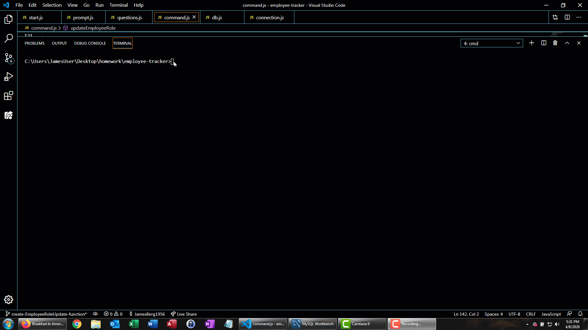

# employee-tracker

## Table of Contents

[Description](./README.md#Description)

[Installation](./README.md#Installation)

[Usage](./README.md#Usage)

[Licensing](./README.md#Licensing)

[Contributing](./README.md#Contributing)

[Testing](./README.md#Testing)

[Questions](./README.md#Questions)
## Description
                        
This project uses a CLI to query a mysql database.
## Installation
                        
1. Clone the repo
                        
`git clone https://github.com/JamesBerg1956/employee-tracker.git`
                        
2. Install npm packages
                        
`npm install`

3. run using node

`node start.js`

## Usage
                        
This project is useful for creating a simple roster of employees related to roles and roles related to departments
## Licensing
                        
This project is licensed under lgpl-3.0.
## Contributing
                        
###### Step 1
                        
* Option 1
                        
  - Fork this repository
                        
* Option 2
                        
  - Clone this repository `git clone https://github.com/JamesBerg1956/employee-tracker.git`
                        
###### Step 2
                        
* Make local changes
                        
###### Step 3
                        
* Create a new pull request using `https://github.com/JamesBerg1956/employee-tracker/compare/`
## Testing
                        
Testing for this project was done manually
## Questions
                        
You can reach me for questions at: james.berg38@yahoo.com